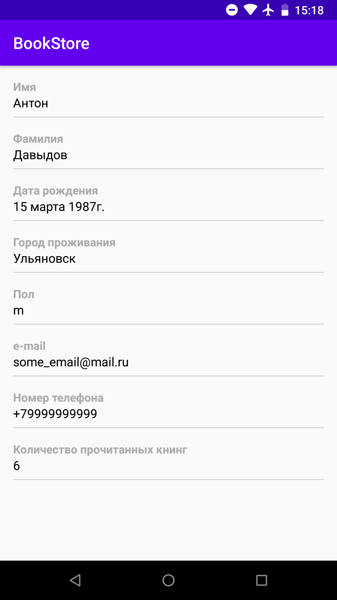
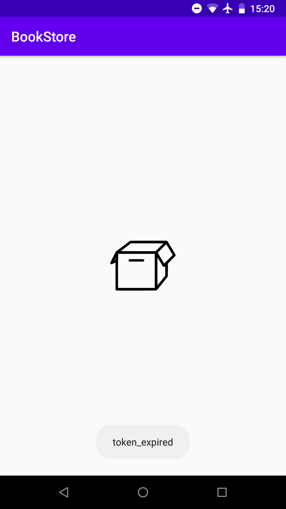
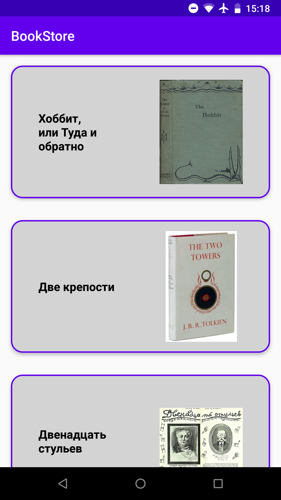

# BookStore

**BookStore** – Android application that represents a part of application for storing and reading books. It consists of two screens – "Profile" screen with user data and "Books" screen with book cards.

Possibilities:
* Retrieving and showing profile and books data using REST API
* Caching profile and books data in local database

### Screenshots

**Profile screen**

***
**Profile screen error state**

***

**Books screen**

